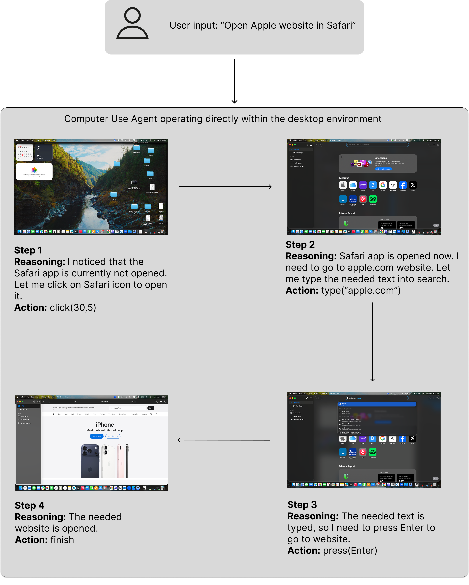
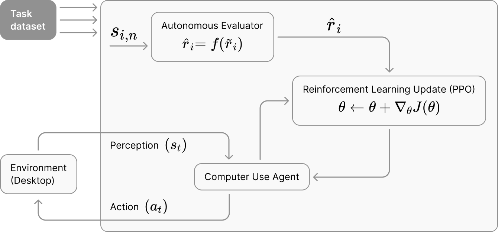

<h1 align="center">Reinforcement Learning with Autonomous Feedback for Computer Use Agents</h1>


This repository contains the code accompanying the thesis **“Reinforcement Learning with Autonomous Feedback for Computer Use Agents.”** The project investigates how autonomous evaluator signals, produced by Vision-Language Models, can be used to assess task completion and support reinforcement learning for Computer Use Agents operating in desktop environments.

## Table of Contents

- [Overview](#overview)
  - [Research Questions](#research-questions)
  - [Contributions](#contributions)
- [Repository Structure](#repository-structure)
- [Installation & Quick Start](#installation--quick-start)
- [Data](#data)
- [Autonomous Evaluators](#autonomous-evaluators)
- [Reinforcement Learning Fine-Tuning](#reinforcement-learning-fine-tuning)
- [Publications and Intermediate Projects](#publications-and-intermediate-projects)
  - [Are We Done Yet?: A Vision-Based Judge for Autonomous Task Completion of Computer Use Agents](#1-are-we-done-yet-a-vision-based-judge-for-autonomous-task-completion-of-computer-use-agents)
  - [CUAAudit: Meta-Evaluation of Vision-Language Models as Auditors of Autonomous Computer-Use Agents](#2-cuaaudit-meta-evaluation-of-vision-language-models-as-auditors-of-autonomous-computer-use-agents)
- [Citation](#citation)


## Overview

Computer Use Agents (CUAs) represent an emerging Human-Computer Interaction (HCI) concept in which users delegate high-level goals to autonomous agents that perceive, reason, and act directly within desktop environments (see example in the image below). A core challenge is that CUAs frequently misidentify whether a task has been completed, leading to false positives and false negatives that undermine reliability in real-world deployment. This thesis investigates the use of Vision-Language Models (VLMs) as autonomous evaluators of CUA task completion. A VLM-based evaluator is used to judge task success from visual observations of the interface, and its feedback is modeled as a noisy reward signal characterized by false-positive and false-negative errors. To address the resulting learning bias, the thesis proposes a noise-corrected reward estimator and integrates it into a reinforcement-learning fine-tuning framework.




### Research Questions

- **RQ1:** Can Vision-Language Models (VLMs) serve as effective autonomous evaluators of task completion for computer-use agents operating in real-world desktop environments?
- **RQ2:** How can noisy autonomous evaluation signals be incorporated as reward feedback for reinforcement learning fine-tuning of CUAs in a statistically principled and robust manner?

### Contributions 

This thesis makes the following contributions:

- **Autonomous task completion evaluation.** We study the use of VLMs as autonomous evaluators for assessing task completion of computer-use agents based solely on visual observations of GUI states, without access to ground-truth success labels or application-specific instrumentation.

- **Problem formulation with noisy feedback.** We formalize task completion evaluation for desktop CUAs as a noisy binary feedback problem, explicitly modeling false positive and false negative errors in autonomous evaluator outputs. This formulation elevates task completion assessment from a heuristic post-processing step to a first-class learning problem.

- **Noise-aware reward design for reinforcement learning.** We propose a statistically grounded approach for incorporating noisy autonomous evaluation signals as reward feedback for reinforcement learning fine-tuning, enabling learning to remain robust despite evaluator uncertainty.

- **End-to-end fine-tuning framework.** We integrate autonomous task evaluation and noise-aware reward correction into a standard policy-gradient reinforcement learning pipeline, enabling end-to-end fine-tuning of computer-use agents without manual annotations, hand-crafted reward functions, or task-specific APIs.


## Repository Structure

```
├── agents/         # Agents implementations and related utilities
├── evaluators/     # Autonomous evaluator models, prompts, and evaluation code
├── research/       # Research scripts for evaluating OpenClaw
├── rl_tuning/      # Reinforcement learning fine-tuning pipeline
├── run_vm/         # Code for running experiments in virtual machine (UTM) environment
├── .flake8         # Linting configuration
├── Makefile        # Commands for setting up linter
├── README.md       # Project documentation
├── datasheet.md    # Dataset documentation
├── pyproject.toml  # Project configuration
└── requirements.txt # Python dependencies
```

## Installation & Quick Start

This repository is organized into several components, each with its own setup details and usage notes.

Install the main dependencies:

```
pip install -r requirements.txt
```

Additional installation and configuration instructions for each part of the repository are available here:

- For evaluators usage, see [`evaluators/README.md`](evaluators/README.md)
- For running agents and collecting trajectories, see [`agents/README.md`](agents/README.md)
- For OpenClaw benchmarking experiments, see [`research/README.md`](research/README.md)
- For RL fine-tuning, see [`rl_tuning/README.md`](rl_tuning/README.md)
- For UTM-based VM control, see [`run_vm/README.md`](run_vm/README.md)


## Data

The dataset is available at Zenodo [link placeholder].

The dataset description is done by the [Datasheets for Datasets](https://arxiv.org/abs/1803.09010) methodology and is available [here](https://github.com/martasumyk/cua-eval-and-finetuning/blob/main/datasheet.md).


## Autonomous Evaluators

The autonomous evaluator is a Vision-Language Model (VLM) that judges whether a CUA has successfully completed a given task, based solely on a screenshot of the final GUI state and the original task description, without access to ground-truth labels or application-specific instrumentation.

Given a task instruction and a final screenshot $s_{i,n}$, the evaluator produces a binary completion signal:

$$\tilde{r}_i = \text{Evaluator}(s_{i,n}, \text{task}) \in \{0, 1\}$$

Because VLM-based evaluators are imperfect, this signal is modeled as **noisy**, characterized by two error rates: False Positive and False Negative.

The `evaluators/` directory contains implementations for both proprietary and open-source evaluators. Each evaluator shares a common interface: it receives a task string and a screenshot (as a base64-encoded image) and returns a dict with `completed` (0 or 1) and `justification` (a short text explanation).


## Reinforcement Learning Fine-Tuning
The Reinforcement Learning (RL) fine-tuning framework closes the loop between autonomous evaluation and agent improvement. The agent interacts with a real desktop environment, producing trajectories of screenshots and actions. After each episode, the final screenshot $s_{i,n}$ is passed to the autonomous evaluator, which produces a noisy binary reward $\tilde{r}_i$. A noise-aware correction converts this into a calibrated reward $\hat{r}_i = f(\tilde{r}_i)$, which is then used to update the agent's policy via PPO:

$$\theta \leftarrow \theta + \nabla_\theta J(\theta)$$


Raw evaluator rewards are corrected using an estimator that accounts for the evaluator's false positive and false negative rates.

where $p$ is the prior probability of task success. This correction reduces systematic bias introduced by evaluator noise and stabilizes the PPO update.





See [`rl_tuning/README.md`](rl_tuning/README.md) for full usage and configuration details.

## Publications and Intermediate Projects

This thesis builds on two intermediate research projects focused on autonomous evaluation and auditing for Computer Use Agents.

### 1. *Are We Done Yet?*: A Vision-Based Judge for Autonomous Task Completion of Computer Use Agents  
**Accepted at [AAAI 2026 Workshop on Trust and Control in Agentic AI (TrustAgent)](https://trustagenticai.github.io/AAAI2026/)**

This project studies whether Vision-Language Models can judge task completion for Computer Use Agents directly from screenshots and task descriptions. It introduces a dataset of 1,260 human-labeled tasks across 42 built-in macOS applications and shows that evaluator feedback can improve agent reliability and self-correction.

[](https://arxiv.org/abs/2511.20067)
[](https://doi.org/10.5281/zenodo.17696742)
[](https://www.researchgate.net/publication/397983499_Are_We_Done_Yet_A_Vision-Based_Judge_for_Autonomous_Task_Completion_of_Computer_Use_Agents)
[](files/AAAI_workshop_poster.pdf)

### 2. *CUAAudit*: Meta-Evaluation of Vision-Language Models as Auditors of Autonomous Computer-Use Agents  
**Accepted at [HEAL @ CHI 2026 Workshop on Human-centered Evaluation and Auditing of Language Models](https://heal-workshop.github.io/)**

This project evaluates Vision-Language Models as autonomous auditors of Computer Use Agents across macOS, Windows, and Linux benchmarks. It studies auditor performance in terms of accuracy, calibration, and inter-model agreement, highlighting both the promise and the limitations of model-based task evaluation.

[](https://arxiv.org/abs/2603.10577)
[](https://www.researchgate.net/publication/401834043_CUAAudit_Meta-Evaluation_of_Vision-Language_Models_as_Auditors_of_Autonomous_Computer-Use_Agents)
[](files/CHI26_workshop_poster.pdf)

## Citation

To be added.

